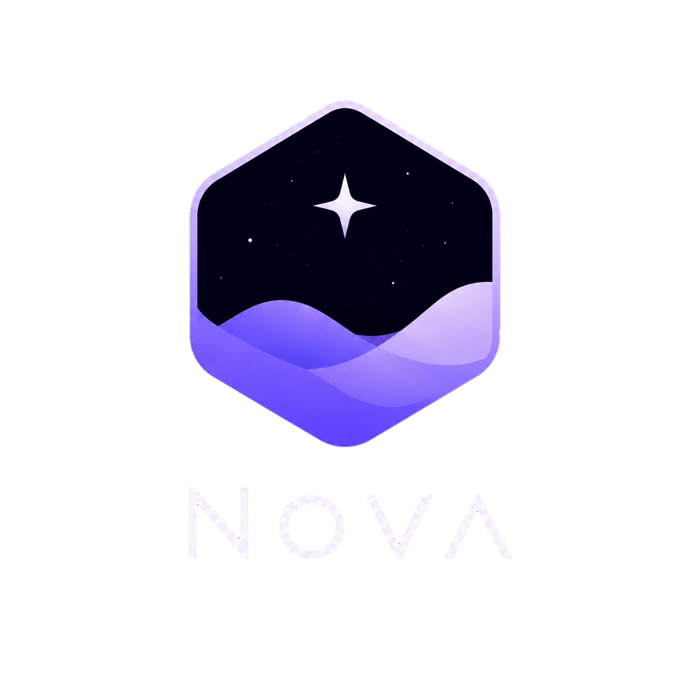
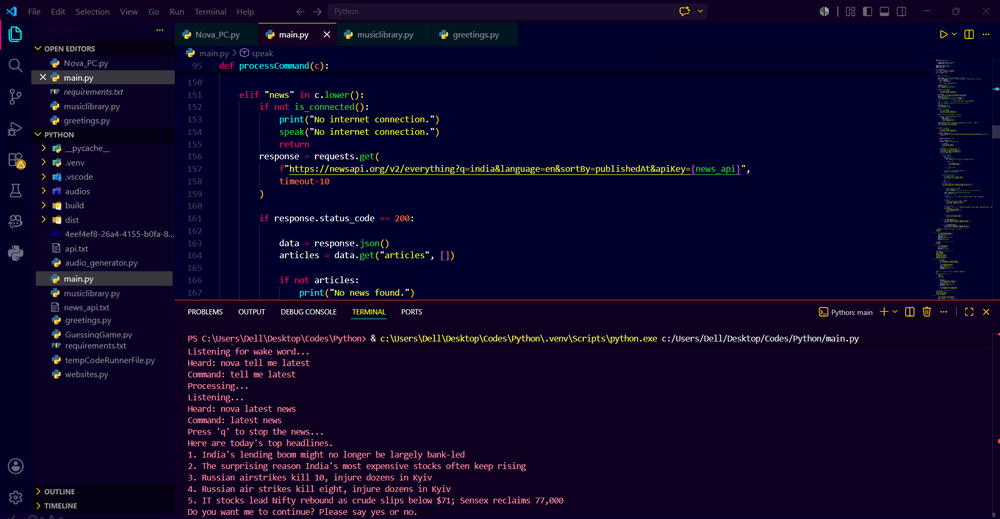
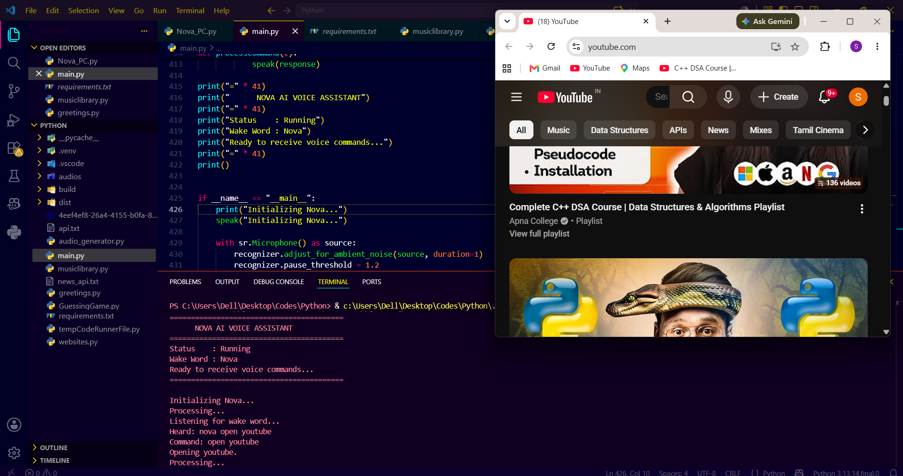
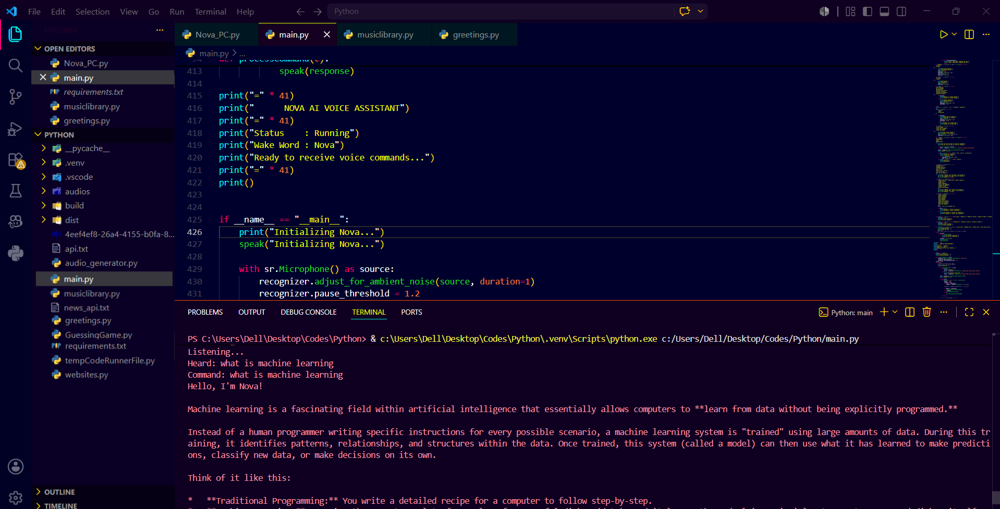
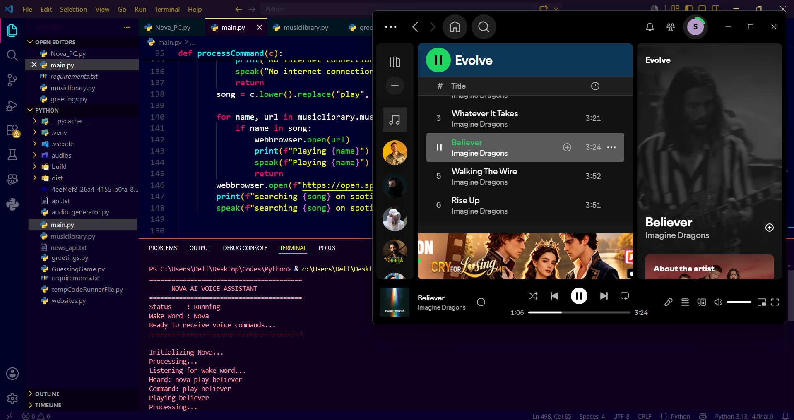

<p align="center">
  
</p>

<h1 align="center">Nova – Personal AI Voice Assistant</h1>

<p align="center">
A Python-based AI Voice Assistant with Speech Recognition, AI-powered conversations, Web Automation, Music Playback, and System Control.
</p>

---

## ✨ Overview

Nova is a personal AI voice assistant built using Python. It can understand voice commands, respond using text-to-speech, automate desktop tasks, search the web, play music, and answer questions using AI.

---

## 📸 Screenshots

### News Mode


### Running Mode


### AI Response


### Music Mode


## 🚀 Features

- 🎙️ Wake-word detection ("Nova")
- 🗣️ Speech Recognition
- 🤖 AI-powered conversations (Gemini API)
- 🌐 Open websites with voice commands
- 🔍 Google Search
- 🎵 Music playback
- 📰 Live news reading
- 🖥️ Open applications
- 📂 Minimize all windows
- ❌ Close all windows
- 🔊 Text-to-Speech responses
- 🇮🇳 Hindi & English voice support

---

## 🛠️ Tech Stack

- Python
- SpeechRecognition
- Google Gemini API
- gTTS
- pygame
- Requests
- Webbrowser
- Git
- GitHub

---

## ⚙️ Installation

Clone the repository

```bash
git clone https://github.com/sauravkr1111/Personal-AI-Voice-assistant.git
```

Go to project folder

```bash
cd Personal-AI-Voice-assistant
```

Install dependencies

```bash
pip install -r requirements.txt
```

Run the assistant

```bash
python main.py
```

---

## 🎤 Supported Commands

Examples:

- Nova
- Open YouTube
- Open Google
- Search Python
- Play Believer
- Latest News
- Minimize all windows
- Close all windows
- What's the weather?
- Tell me a joke

---

## 📁 Project Structure

```
Personal-AI-Voice-assistant
│
├── audios/
├── screenshots/
├── nova-logo.png
├── greetings.py
├── musiclibrary.py
├── websites.py
├── main.py
├── README.md
└── requirements.txt
```

---

## 📄 License

This project is licensed under the MIT License.

---

## 👨‍💻 Developer

**Saurav Kumar**

GitHub:
https://github.com/sauravkr1111

LinkedIn:
https://www.linkedin.com/in/saurav-kumar-129s

Portfolio:
https://sauravkr-dev-portfolio.netlify.app

---

⭐ If you like this project, don't forget to give it a Star!
