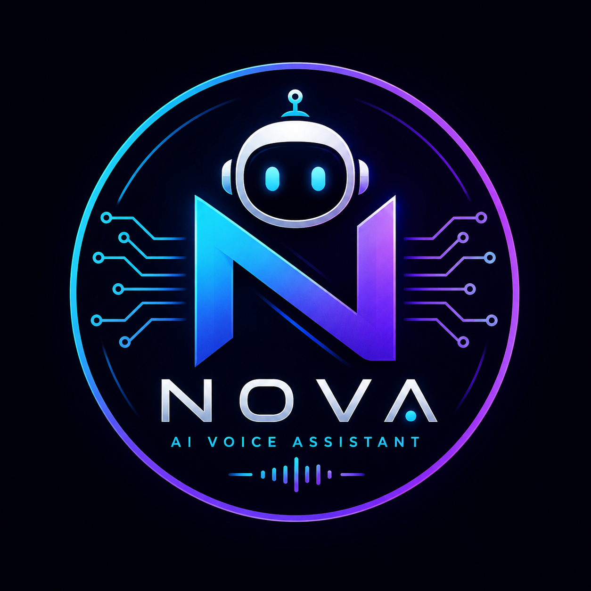

  

# Nova – Personal AI Voice Assistant

Nova is a Python-based AI voice assistant with wake-word detection, speech recognition, AI-powered conversations, Google Search, website opening, music playback, and live news reading.
